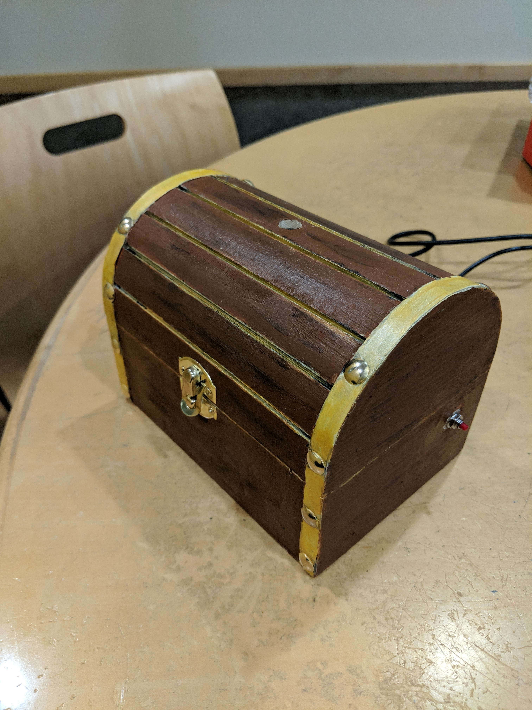

# Voice Recognition Lock Box

### Team Members

Mark Musil (mmusil@pdx.edu), Amanda Voegtlin (voegtlin@pdx.edu), Samantha Fink (scleary@pdx.edu), Rawan Abdo (rabdo@pdx.edu)

## Project Description

For the Portland State University pre-capstone class (ECE 411) the team designed a voice-activated lockbox that can be used to protect belongings. Using the open source [speech-to-text library uSpeech] (https://github.com/arjo129/uSpeech) an AtMega32U4 was programmed to activate a solenoid in response to the diction of a password ("shore"). The potential market for such a product is adolescents with small belongings such as jewelry or diaries that they wish to protect. 

Please see the presentation file "Presentation_Group3.pdf" for a thorough description including block diagrams, functional flowcharts and more. 

